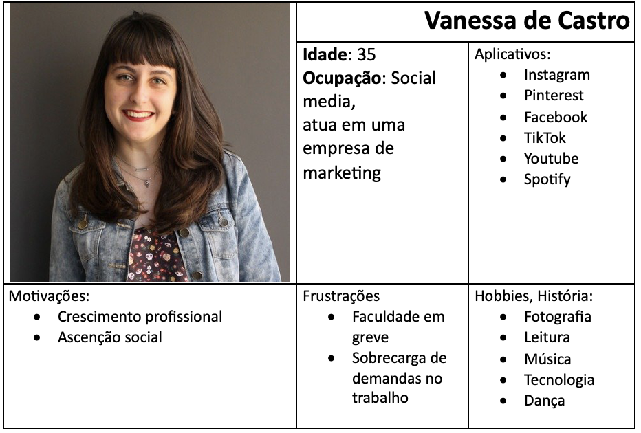
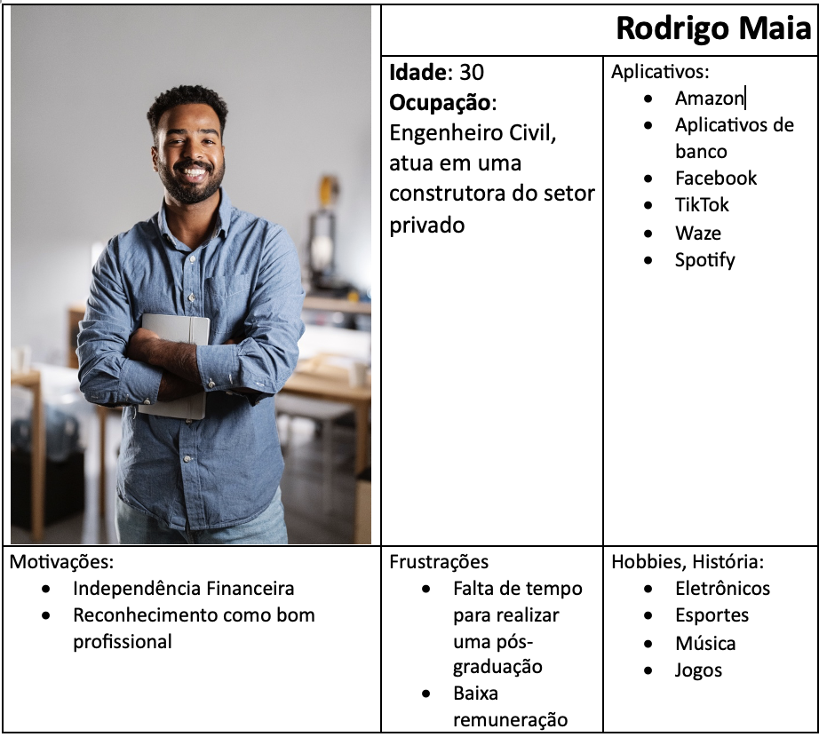
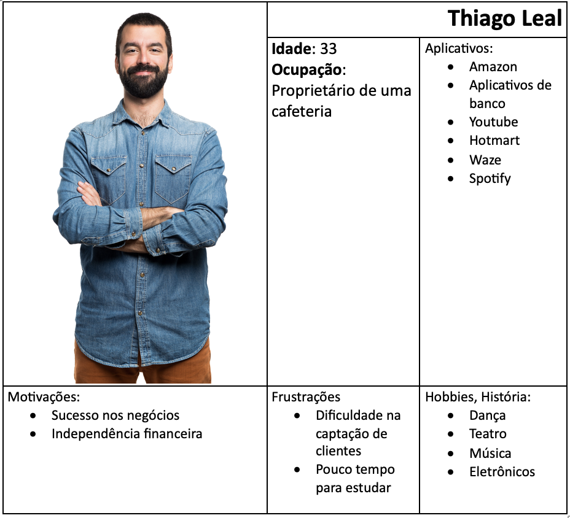
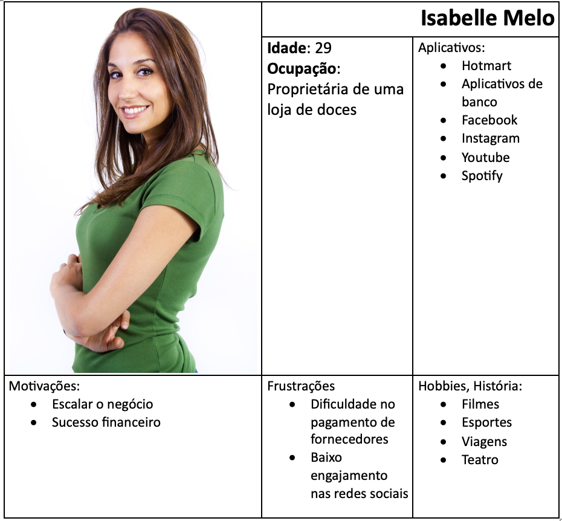
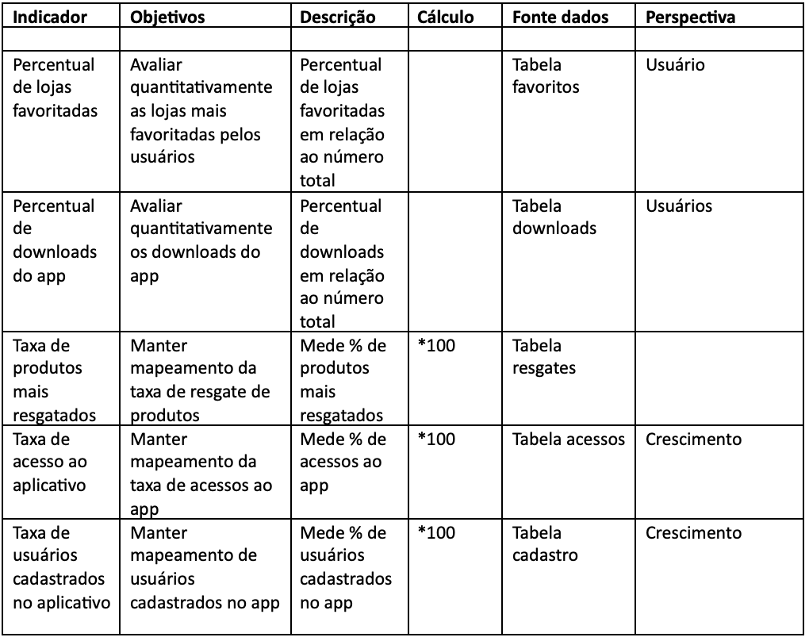
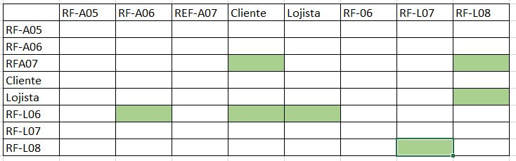
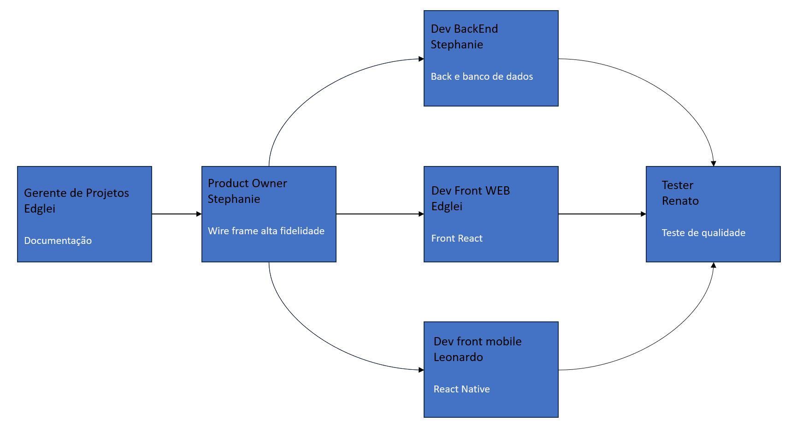

# Especificações do Projeto

Consumidores em geral, sempre estão em busca de benefícios na hora de realizar compras, seja na forma de vouchers, brindes, descontos, cashback, etc. Por outro lado, os pequenos lojistas buscam formas de conseguir atrair mais clientes e por consequência aumentar as vendas. É comprovado que a venda por bonificação é uma estratégia que se apresenta com maior atratividade do que descontos de percentual baixo. O Fidelpoints vem como a maneira ideal de beneficiar os dois lados, trazendo vantagens para os consumidores ao realizar compras e auxiliando os pequenos lojistas a fidelizar cada vez mais clientes com uma plataforma de pontuação.

A escolha do referido problema foi definida por meio de discussões e estudos realizados pelos membros da equipe. Os detalhes levantados nesse processo foram consolidados na forma de personas e histórias de usuários.

## Personas

## Histórias de Usuários

Com base na análise das personas forma identificadas as seguintes histórias de usuários:

|EU COMO... `PERSONA`| QUERO/PRECISO ... `FUNCIONALIDADE` |PARA ... `MOTIVO/VALOR`                 |
|--------------------|------------------------------------|----------------------------------------|
|Vanessa de Castro | Quero adquirir produtos para o meu hobby receber pontos em troca | Trocar por itens a minha escolha |
|Vanessa de Castro | Quero ter poder favoritar a  minha loja predileta | Acumular pontos em uma loja específica |
|Rodrigo Maia | Ter controle e visibilidade da minha pontuação | Quero visualizar meus pontos a qualquer momento momento |
|Rodrigo Maia | Quero visualizar meus pedidos de resgate a qualquer momento | Ter controle sob o andamento do resgate |
|Rodrigo Maia | Quero visualizar meu histórico de resgate  | Ter visibilidade dos itens que já resgatei |
|Thiago Leal | Quero poder cadastrar a minha loja | Captar mais clientes |
|Thiago leal | Quero poder cadastrar produtos | Para que os meus clientes possam realizar a troca dos pontos |
|Isabelle Melo | Ter controle e visibilidade da lista de clientes | Entender quem são os clientes mais fiéis |
|Isabelle Melo | Quero visualizar os resgates dos clientes | Validar se o cliente já pode retirar o item escolhido |

## Modelagem do Processo de Negócio 

### Análise da Situação Atual

Atualmente muitos usuários sentem falta uma plataforma específica de acumulo de pontos, assim como lojistas tem a necessidade de ter alguma ferramenta que auxilie no engajamento de novos clientes. O usuário tem a possiblidade de saber qual a loja mais próxima que acumula pontos, ter visibilidade dos itens que podem ser resgatados e poder acompanhar o andamento dos resgates.

### Descrição Geral da Proposta

Nossa aplicação visa recompensar os clientes por suas compras, incentivando a fidelidade às lojas participantes. Os clientes acumulam pontos que podem ser convertidos em descontos ou prêmios, enquanto os lojistas aumentam a retenção de clientes e impulsionam as vendas ao oferecerem cashback. O aplicativo cria um ecossistema benéfico para ambas as partes, promovendo uma relação de ganha-ganha entre clientes e lojistas.

### Processo 1 – NOME DO PROCESSO

Apresente aqui o nome e as oportunidades de melhorias para o processo 1. Em seguida, apresente o modelo do processo 1, descrito no padrão BPMN. 

### Processo 2 – NOME DO PROCESSO

Apresente aqui o nome e as oportunidades de melhorias para o processo 2. Em seguida, apresente o modelo do processo 2, descrito no padrão BPMN.

## Indicadores de Desempenho

Apresente aqui os principais indicadores de desempenho e algumas metas para o processo. Atenção: as informações necessárias para gerar os indicadores devem estar contempladas no diagrama de classe. Colocar no mínimo 5 indicadores. 

Usar o seguinte modelo: 

Obs.: todas as informações para gerar os indicadores devem estar no diagrama de classe a ser apresentado a posteriori. 

## Requisitos

O escopo funcional do projeto é definido por meio dos requisitos funcionais que descrevem as possibilidades interação dos usuários, bem como os requisitos não funcionais que descrevem os aspectos que o sistema deverá apresentar de maneira geral. Estes requisitos são apresentados a seguir.

### Requisitos Funcionais

|ID    | Descrição do Requisito  | Prioridade |
|------|-----------------------------------------|----|
|RF-001| O aplicativo deverá permitir que o usuário possa se cadastrar ou fazer login e desta forma tenha acesso às funcionalidades disponibilizadas.  | ALTA | 
|RF-002| O aplicativo deverá permitir que o usuário redefina sua senha caso o mesmo se esqueceça dela.   | Alta |
|RF-003| O aplicativo deve permitir o usuário verificar a quantidade de pontos.   | Alta |
|RF-004| O aplicativo deverá permitir que o usuário pesquise por um produto específico em um campo de busca na tela inicial.   | Alta |
|RF-005| O aplicativo deve permitir o usuário defina quantos pontos valem o seu produto .   | Alta |
|RF-006| Na tela inicial o usuário deverá ter acesso a uma lista com os principais produtos recomendados pelo sistema.   | Média |
|RF-007| O aplicativo deve permitir o usuário criar listas para armazenar determinados produtos.   | Média |
|RF-008|O usuário deve ter a possibilidade de fazer a gestão de suas listas inserindo e removendo produtos.    | Média |
|RF-009| O usuário deve poder criar e ordenar a quais produtos serão trocados.  | Baixa |
|RF-010| O usuário deve poder ordenar a quantidade de pontos que vale o produto.   | Baixa |
|RF-011| O aplicativo deve permitir que o usuário insira e remova produtos de acordo com a sua estrategia de vendas.   | Baixa |

### Requisitos não Funcionais

|ID     | Descrição do Requisito  |Prioridade |
|-------|-------------------------|----|
|RNF-001| O aplicativo deve ser publicado em um ambiente acessível publicamente. | Alta | 
|RNF-002| O aplicativo deverá ser responsivo permitindo a visualização em um celular de forma adequada |  Alta | 
|RNF-003| O aplicativo deve ser compatível com o sistema andriod |  Alta | 
|RNF-004| O aplicativo deve ter bom nível de contraste entre os elementos da tela em conformidade  |  Média | 
|RNF-005| O aplicativo deve ter um tema black para que deixe os usuários mais confortáveis durante o usuo. |  Média | 
|RNF-006| O aplicativo deve utilizar cores e ícones que sejam mais intuitivos para o usuário final. |  Média | 
|RNF-007| O aplicativo deve ser em português BR. |  BAIXA | 

Com base nas Histórias de Usuário, enumere os requisitos da sua solução. Classifique esses requisitos em dois grupos:

- [Requisitos Funcionais
 (RF)](https://pt.wikipedia.org/wiki/Requisito_funcional):
 correspondem a uma funcionalidade que deve estar presente na
  plataforma (ex: cadastro de usuário).
- [Requisitos Não Funcionais
  (RNF)](https://pt.wikipedia.org/wiki/Requisito_n%C3%A3o_funcional):
  correspondem a uma característica técnica, seja de usabilidade,
  desempenho, confiabilidade, segurança ou outro (ex: suporte a
  dispositivos iOS e Android).
Lembre-se que cada requisito deve corresponder à uma e somente uma
característica alvo da sua solução. Além disso, certifique-se de que
todos os aspectos capturados nas Histórias de Usuário foram cobertos.

## Restrições

As questões que limitam a execução desse projeto e que se configuram como obrigações claras para o desenvolvimento do projeto em questão são apresentadas na tabela a seguir.

|ID| Restrição                                             |
|--|-------------------------------------------------------|
|01| O projeto deverá ser entregue no final do semestre letivo, não podendo extrapolar a data de 10/12/2023. |
|02| A equipe deverá utilizar específicamente react native no front end.         |
|02| A equipe não poderá ter auxilios externos se de outros integrantes dela mesma para o desenvolvimento do projeto.     |

## Diagrama de Casos de Uso

O diagrama de casos de uso é o próximo passo após a elicitação de requisitos, que utiliza um modelo gráfico e uma tabela com as descrições sucintas dos casos de uso e dos atores. Ele contempla a fronteira do sistema e o detalhamento dos requisitos funcionais com a indicação dos atores, casos de uso e seus relacionamentos. 

As referências abaixo irão auxiliá-lo na geração do artefato “Diagrama de Casos de Uso”.

> **Links Úteis**:
> - [Criando Casos de Uso](https://www.ibm.com/docs/pt-br/elm/6.0?topic=requirements-creating-use-cases)
> - [Como Criar Diagrama de Caso de Uso: Tutorial Passo a Passo](https://gitmind.com/pt/fazer-diagrama-de-caso-uso.html/)
> - [Lucidchart](https://www.lucidchart.com/)
> - [Astah](https://astah.net/)
> - [Diagrams](https://app.diagrams.net/)

# Matriz de Rastreabilidade

# Gerenciamento de Projeto

De acordo com o PMBoK v6 as dez áreas que constituem os pilares para gerenciar projetos, e que caracterizam a multidisciplinaridade envolvida, são: Integração, Escopo, Cronograma (Tempo), Custos, Qualidade, Recursos, Comunicações, Riscos, Aquisições, Partes Interessadas. Para desenvolver projetos um profissional deve se preocupar em gerenciar todas essas dez áreas. Elas se complementam e se relacionam, de tal forma que não se deve apenas examinar uma área de forma estanque. É preciso considerar, por exemplo, que as áreas de Escopo, Cronograma e Custos estão muito relacionadas. Assim, se eu amplio o escopo de um projeto eu posso afetar seu cronograma e seus custos.

## Gerenciamento de Tempo

Os gráficos foram feitos baseado nas tarefas das etapas do projeto.

## Gerenciamento de Equipe

O gerenciamento adequado de tarefas contribuirá para que o projeto alcance altos níveis de produtividade. Por isso, é fundamental que ocorra a gestão de tarefas e de pessoas, de modo que os times envolvidos no projeto possam ser facilmente gerenciados. 

## Gestão de Orçamento

O orçamento foi feito para os 5 meses de projeto com valores de forma fictícia , baseada nos seguintes link :

Recursos Humanos. Hardware. Rede e Lincenças. Software.

